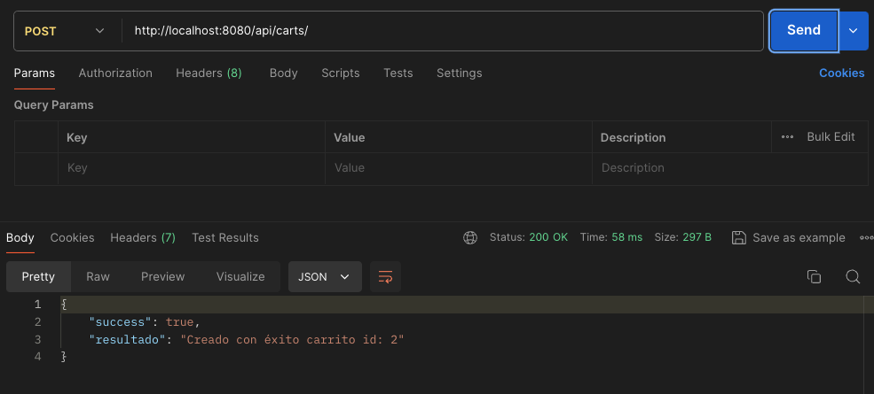

# proyecto_jcampos
Proyecto Backend

## Pruebas
Ejecuta las pruebas con:
```sh
npm start
```
Nota: actualmente está configurado con el puerto 8080

## Rutas de API
### Api de producto
- [x] Crear un producto
http://localhost:8080/api/products/


- [x] Obtener todos los productos
http://localhost:8080/api/products?limit=10


- [x] Obtener producto por id
http://localhost:8080/api/products/10


- [x] Editar un producto
http://localhost:8080/api/products/10


- [x] Eliminar un producto
http://localhost:8080/api/products/3


### Api de carrito
- [x] Crear un carrito de compras
http://localhost:8080/api/carts/


- [x] Agregar un producto al carrito
http://localhost:8080/api/carts/:idCarrito/product/:idProducto


- [x] Consultar productos del carrito
http://localhost:8080/api/carts/:id


## Rutas de Views
- [x] Lista de Productos
http://localhost:8080/
Esta lista muestra todos los productos almacenados. Tiene un hipervínculo para ir a lista de productos con websocket.


- [x] Lista de Productos con websocket
http://localhost:8080/realtimeproducts
Lista de productos con websocket en donde se visualiza el cambio si se agrega o elimina un producto. Tiene hipervínculo a lista de productos.

