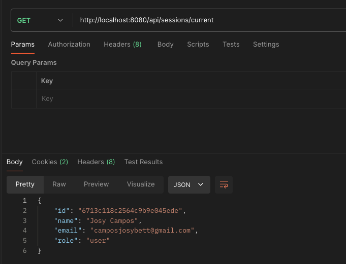

# proyecto_jcampos
Proyecto Backend

## Pruebas
Ejecuta las pruebas con:
```sh
npm start
```
Nota: actualmente está configurado con el puerto 8080

## Rutas de API
### Api Usuarios
- [x] Registrar usuario
- Método: POST
http://localhost:8080/api/sessions/register
```sh
// Request para usuario
{
    "first_name": "User",
    "last_name": "Corder",
    "email": "josybett@coderhouse.com",
    "age": 30,
    "password": "Test123"
}
```

- [x] Iniciar sesión:
- Método: POST
http://localhost:8080/api/sessions/login

```sh
// Request para iniciar sesión Login Usuario
{
    "email": "josybett@coderhouse.com",
    "password": "Test123"
}
```

```sh
// Request para iniciar sesión Login Admin
{
  "email": "admin@coderhouse.com",
  "password": "Admin123"
}
```

- [x] Consultar usurario logueado
- Método: GET
http://localhost:8080/api/sessions/current


- [x] Cerrar sesión
- Método: POST
http://localhost:8080/api/sessions/logout


### Api de producto
- [x] Crear un producto
- Método: POST
- Reservada función para rol admin
http://localhost:8080/api/products/


- [x] Obtener todos los productos
- Método: GET
http://localhost:8080/api/products?limit=10


- [x] Obtener producto por id
- Método: GET
http://localhost:8080/api/products/:idProduct


- [x] Editar un producto
- Método: PUT
- Reservada funciónpara rol admin
http://localhost:8080/api/products/10


- [x] Eliminar un producto
- Método: DELETE
- Reservada funciónpara rol admin
http://localhost:8080/api/products/3


### Api de carrito
- [x] Crear un carrito de compras
- Método: POST
http://localhost:8080/api/carts/


- [x] Agregar un producto al carrito
- Método: POST
http://localhost:8080/api/carts/:idCarrito/product/:idProducto


- [x] Consultar productos del carrito
- Método: GET
http://localhost:8080/api/carts/:id


- [x] Eliminar un producto del carrito
- Método: DELETE
http://localhost:8080/api/carts/:idCarrito/product/:idProducto

- [x] Vaciar carrito
- Método: DELETE
http://localhost:8080/api/carts/:idCarrito

- [x] Procesar compra
- Método: POST
http://localhost:8080/api/carts/:idCarrito/purchase


## Rutas de Views
- [x] Lista de Productos
http://localhost:8080/
Esta lista muestra todos los productos almacenados. Tiene un hipervínculo para ir a lista de productos con websocket.


- [x] Lista de Productos con websocket
http://localhost:8080/realtimeproducts
Lista de productos con websocket en donde se visualiza el cambio si se agrega o elimina un producto. Tiene hipervínculo a lista de productos.

